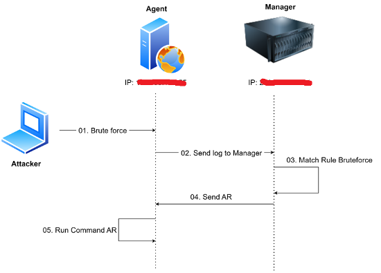

# Deploy an automated security incident monitoring and response framework
## Practice 1: Detect and block IP Brute force attacks (Scenario 1)

## Practice 2: Detect and remove malicious code (Scenario 2)

## Practice 3: Isolate the attacked server (Scenario 3)
