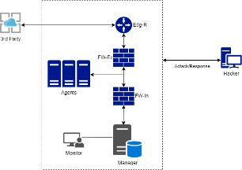

# Deploy an automated security incident monitoring and response framework
The system model for evaluating the security incident monitoring and response framework is shown in Figure 4. The system includes one Manager and three Agents. The Manager is responsible for collecting logs from the Agents, using automated log analysis tools to detect events that match predefined rules, thereby generating alerts and sending warning emails to the administrator. It also responds to security incidents based on corresponding scripts and commands. The Agents are tasked with collecting events and sending them to the Manager, as well as executing requests controlled by the Manager to prevent specific attacks.

* The Manager functions to manage the collection and analysis of data from the Agents.
* Elasticsearch performs the indexing and searching functions.
* Filebeat is responsible for securely forwarding the stored alerts and events to Elasticsearch.
* Agents are deployed on Linux and Windows operating systems.
## Practice 1: Detect and block IP Brute force attacks (Scenario 1)

## Practice 2: Detect and remove malicious code (Scenario 2)

## Practice 3: Isolate the attacked server (Scenario 3)
